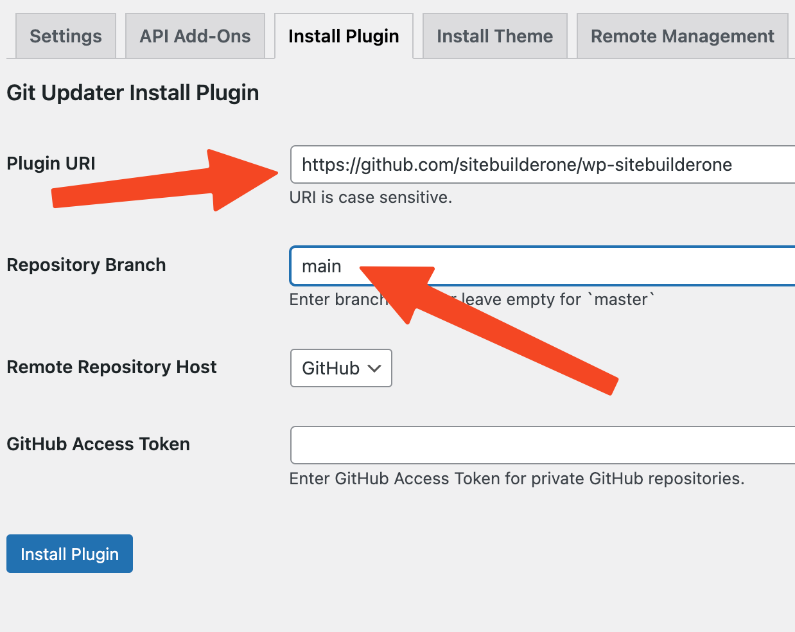

# wp-sitebuilderone

All-in-One plugin for local business websites that are WordPress powered, using Bootstrap CSS via the [LiveCanvas](https://www.sitebuilderone.com/go/livecanvas) and Picostrap theme.

## How it works

Using Advanced Custom Fields (ACF) options, areas of the website, such as header, footer and schema are pre-built using WordPress shortcodes.

## Disclaimer: Beta

⚠️ **This plugin is currently in BETA.**  
It is intended for development and testing purposes only and is **not recommended for production use**. Features and functionality may change, and there could be unresolved bugs or issues. Use at your own discretion.

## Requirements

1. [LiveCanvas](https://www.sitebuilderone.com/go/livecanvas) plugin
2. [Picostrap](https://picostrap.com/) theme + blank child theme
3. ACF Pro (Options)
3. Plugin: [Git-updater](https://github.com/afragen/git-updater)

## Setup

1. Install [Git-updater](https://github.com/afragen/git-updater)
2. Point to https://github.com/sitebuilderone/wp-sitebuilderone

## Changelog

For details on changes in this project, see the [Changelog](CHANGELOG.md).

